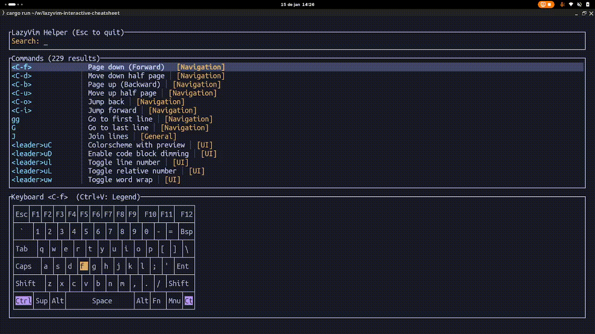
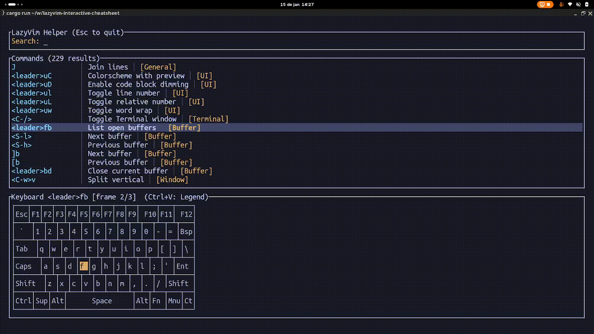

# LazyVim Interactive Cheatsheet

Interactive TUI to search LazyVim keybindings and visualize key sequences on a keyboard layout.

## Demos
Search and filter keybindings:


Keyboard animation for a selected command:


Toggle Animation/Legend view:


## Quick start
```bash
cargo run
```

## How to use
1. Start typing to filter keybindings by keys, description, or category.
2. Use Up/Down (or Tab/Shift-Tab) to move the selection.
3. Watch the keyboard animation to learn the sequence.
4. Press Ctrl+V to toggle between Animation and Legend views.
5. Press Esc to clear the search; Esc again (on empty search) quits.

## Controls
- Type to search.
- Backspace removes a character from the query.
- Up/Down or Tab/Shift-Tab moves the selection.
- Esc clears the query; Esc on empty query quits.
- Ctrl+C quits.
- Ctrl+V toggles Animation/Legend view.

## Customize the keybindings
Commands live in `data/commands.json` and are embedded at compile time. Update this file and rebuild to see changes.

Each entry uses this shape:
```json
{
  "keys": "<leader>ff",
  "description": "Find files",
  "category": "search",
  "mode": "normal"
}
```

Modes default to `normal` when omitted.

## Credits
Cheatsheet data is based on "LazyVim (neovim) Cheat Sheet" by thesujit on Cheatography:
https://cheatography.com/thesujit/cheat-sheets/lazyvim-neovim/#google_vignette

## Build (if you don't want `cargo run`)
```bash
cargo build
./target/debug/lazyvim-interactive-cheatsheet
```
